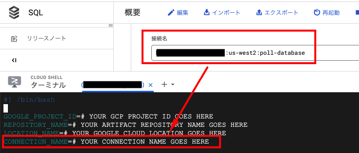

# Description  
タブキー または スペースキー を選択して投票する。

# What service do you use?  
Cloud Run
Cloud SQL
言語：Python

# Initialization  
1. Artifact Registry用のDockerリポジトリを作成する。  

```
export GOOGLE_PROJECT_ID=# YOUR GCP PROJECT ID GOES HERE
export REPOSITORY_NAME=# YOUR ARTIFACT REPOSITORY NAME GOES HERE
export LOCATION_NAME=# YOUR GOOGLE CLOUD LOCATION GOES HERE

gcloud artifacts repositories create $REPOSITORY_NAME \
    --repository-format=docker \
    --location=$LOCATION_NAME \
    --description="Docker repository" \
    --project=$GOOGLE_PROJECT_ID
```

2. vimコマンドを使って、`build-and-deploy.sh` を修正  
下記の環境変数を修正してください。  

```
GOOGLE_PROJECT_ID=# YOUR GCP PROJECT ID GOES HERE
REPOSITORY_NAME=# YOUR ARTIFACT REPOSITORY NAME GOES HERE
LOCATION_NAME=# YOUR GOOGLE CLOUD LOCATION GOES HERE
CONNECTION_NAME=# YOUR CONNECTION NAME GOES HERE
```

`CONNECTION_NAME` はCloudSQLインスタンスの`接続先名`を記入してください。



3. `build-and-deploy.sh` スクリプトに実行権限がない場合、  
コマンドを実行して、ファイルに実行権限を与える。  

```
chmod +x ./build-and-deploy.sh
```

# Deploy  
`deploy.sh` スクリプトを実行して、`Artifact Registory` に対して、  
イメージのビルドとプッシュを行い、Cloud RunのServiceをデプロイする。  

```
./build-and-deploy.sh
```

# create and insert
`テーブル作成`と`データ挿入`を行う為のサンプルコマンドです。
```sql

CREATE TABLE IF NOT EXISTS votes
( vote_id SERIAL NOT NULL, time_cast timestamp NOT NULL,
candidate VARCHAR(6) NOT NULL, PRIMARY KEY (vote_id) );

CREATE TABLE IF NOT EXISTS totals
( total_id SERIAL NOT NULL, candidate VARCHAR(6) NOT NULL,
num_votes INT DEFAULT 0, PRIMARY KEY (total_id) );

INSERT INTO totals (candidate, num_votes) VALUES ('TABS', 0);
INSERT INTO totals (candidate, num_votes) VALUES ('SPACES', 0);

```